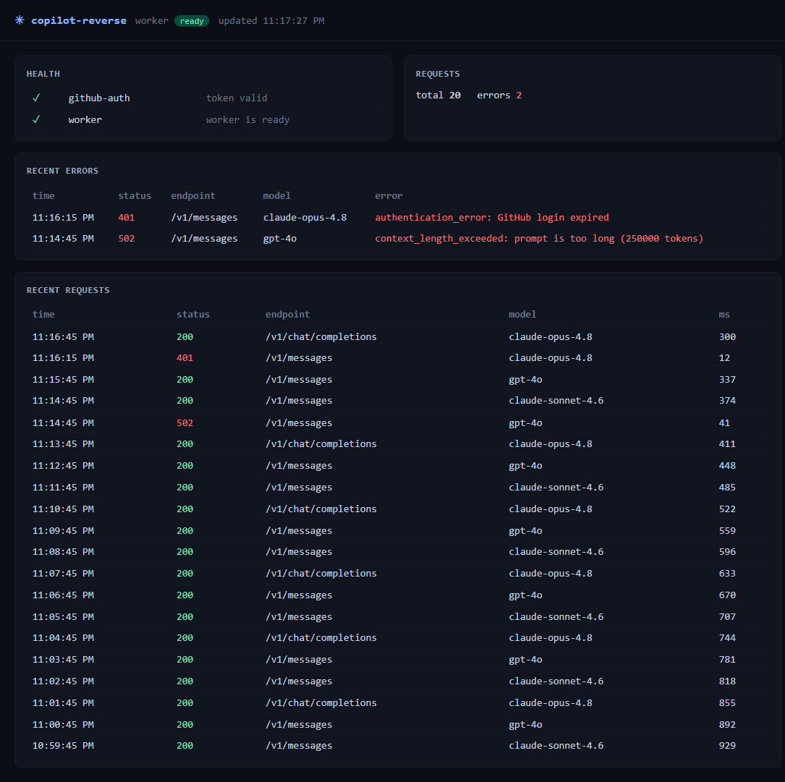

# copilot-reverse

**Use the GitHub Copilot subscription you already pay for as a local Claude Code / Codex backend.**
No new API keys. No per-token bills. One terminal app.

```
  ┌─────────────┐        ┌───────────────────┐        ┌─────────────┐
  │ Claude Code │ ─────▶ │  copilot-reverse  │ ─────▶ │   Copilot   │
  │   / Codex   │  local │  (your machine)   │  proxy │  (your sub) │
  └─────────────┘        └───────────────────┘        └─────────────┘
```

> **Disclaimer:** The GitHub Copilot integration uses community-documented,
> unofficial endpoints, for use with your own Copilot subscription only. It may
> break if GitHub changes these endpoints.

---

## 60-second start

```bash
npx copilot-reverse
```

1. It asks you to log in to GitHub (device code — paste a code in your browser). One time only.
2. The terminal app launches. You'll see a prompt and a status bar.
3. In the app, type:
   ```
   /setup-claude
   ```
   Pick a model (e.g. **claude-opus-4.8 (1M)**), choose **global**, done.
4. Open a **new** terminal and run `claude`. It's now talking to Copilot through copilot-reverse. 🎉

That's it. Codex users: run `/setup-codex` instead.

Here's the app itself — a prompt, a live status bar, and slash-command autocomplete:

```text
 ✳ copilot-reverse                                                       worker: ready

 Type a message to chat with the assistant, or /help for commands.
╭─────────────────────────────────────────────────────────────────────────────────────╮
│ › /setup                                                                              │
╰─────────────────────────────────────────────────────────────────────────────────────╯
  ❯ /setup-claude   print Claude Code config
    /setup-codex    print Codex/OpenAI config
    /setup-status   show configured endpoints
    ↑↓ navigate · tab complete · enter run
 model claude-opus-4.8  ·  daemon ready  ·  claude u:✓ p:○  codex u:✓ p:○  ·  /help
```

---

## What can I do in the app?

Just **talk to it** — it understands plain English and will do the work for you:

> *"list models"* → shows every model + its context window
> *"set up claude"* → configures Claude Code
> *"is the worker healthy?"* → runs a health check
> *"why did my last request fail?"* → shows the error

Prefer commands? Type `/` to see them all. The essentials:

| Command | What it does |
|---|---|
| `/setup-claude` · `/setup-codex` | Point Claude Code / Codex at copilot-reverse |
| `/model` | Switch the chat model (1M-context models marked) |
| `/status` · `/doctor` | Is everything healthy? |
| `/logs` · `/metrics` | What ran, what failed, and why |
| `/dashboard` | Open a live web dashboard in your browser |
| `/report` | File a pre-filled bug report (diagnostics only — no prompts) |
| `/reset-claude` · `/reset-codex` | Undo setup, restore original config |
| `/login` · `/logout` | Sign in to GitHub (device-code) · sign out (remove token) |
| `/help` · `/quit` | List commands · exit |

### The live dashboard

`/dashboard` opens a self-refreshing web view of everything happening through the proxy — worker
health, request volume, and (most useful) recent **errors with their real messages**:



---

## Connect your own tools

Already have something that speaks OpenAI or Anthropic? Point it here:

- **OpenAI-compatible:** `http://127.0.0.1:7891/v1`
- **Anthropic-compatible:** `http://127.0.0.1:7891`

Any API key value works locally (it's your machine). Example:

```bash
export ANTHROPIC_BASE_URL=http://127.0.0.1:7891
export ANTHROPIC_API_KEY=local
claude
```

---

## The status bar, decoded

The bottom line of the app tells you everything at a glance:

```text
model claude-opus-4.8  ·  daemon ready  ·  claude u:✓ p:○  codex u:○ p:○  ·  /help
```

- **worker / daemon** — green `ready` means the proxy is up and self-healing.
- **claude u:✓ p:○** — Claude Code is configured at the **u**ser (global) level, not in this **p**roject. Read live from your real config files.

---

## Troubleshooting

**"context 100%" or `/compact` fails in Claude Code**
Re-run `/setup-claude` and pick a **1M** model (e.g. `claude-opus-4.8 (1M)`). copilot-reverse writes
the right context-window hint so the client stops assuming a small window. Then restart Claude Code.

**"GitHub login expired"**
Your Copilot session lapsed. You don't need to restart anything — when a chat fails, copilot-reverse
detects it and tells you right there:

```text
assistant error: 401 authentication_error: GitHub login expired
  ↳ your GitHub login looks expired — run /login to sign in again
```

Just type **`/login`**, complete the device-code prompt, and you're back — the worker reloads the new
token automatically. (Switching accounts? `/logout` first, then `/login`.)

**A request failed and I don't know why**
Type `/logs` (or ask *"why did that fail?"*). Every failure is captured with its real upstream
message. Still stuck? `/report` opens a pre-filled GitHub issue with diagnostics — **never** your
prompt content.

**Want to undo everything**
`/reset-claude` and `/reset-codex` remove exactly the keys copilot-reverse added and leave the rest
of your config untouched.

---

## Good to know

- **Your data stays local.** The app proxies between your editor and Copilot on `127.0.0.1`. Your
  GitHub token lives only in `~/.copilot-reverse/creds.json` on your own disk.
- **It heals itself.** If the proxy crashes, the supervisor restarts it with backoff and records why.
- **Unofficial endpoints.** This uses community-documented Copilot endpoints with *your own*
  subscription. It may break if GitHub changes them — that's the trade-off for not needing extra keys.

---

## Architecture

Three processes, one terminal app:

- **TUI** (Ink) — the `copilot-reverse` process: REPL + slash commands + a claude-agent-sdk
  assistant (which dogfoods copilot-reverse's own Anthropic endpoint).
- **Supervisor** (:7890) — control API + SQLite + self-healing worker supervision.
- **Worker** (:7891) — OpenAI `/v1/chat/completions` + Anthropic `/v1/messages` → Copilot,
  with tool-use translation both ways.

## Development

Requires Node >=20.

```bash
npm install && npm test && npm run build
```

### End-to-end tests

The [`e2e/`](e2e/) folder holds cross-module end-to-end scenarios (real worker + supervisor +
TUI wiring, fake Copilot provider). The case catalog is [`e2e/cases.md`](e2e/cases.md) and the
latest run is [`e2e/RESULTS.md`](e2e/RESULTS.md).

**Every code change must keep the full e2e suite green.** `npm test` runs it (the suite is
included in the default vitest run); `npm run test:e2e` runs only the e2e cases. After a change,
re-run and update `e2e/RESULTS.md`.

### Test notes

- **TUI input tests** (`tests/tui/app.test.tsx`): the test waits ~30 ms after
  `render()` before writing to `stdin`. This is not flakiness padding — Ink's
  `useInput` subscribes to stdin asynchronously after mount, so writes issued in
  the same tick as `render()` are dropped. The delay lets the subscription
  attach; assertions are otherwise unchanged.

---

Questions or bugs? Use `/report` from inside the app, or open an issue on
[GitHub](https://github.com/wangcansunking/copilot-reverse). Happy hacking. 🚀
